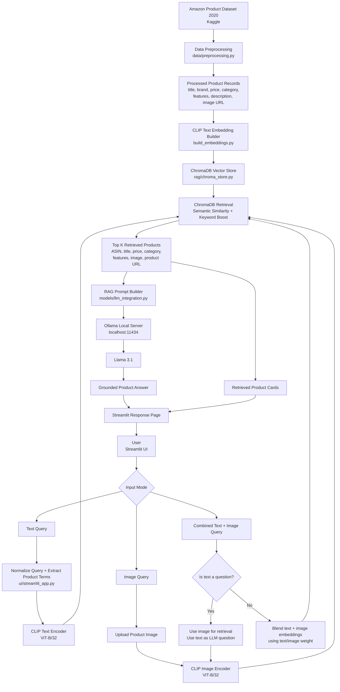

# Architecture Diagram

## Component Summary

| Layer | Component | Purpose |
| --- | --- | --- |
| Data | Amazon Product Dataset 2020 | Product metadata and image URLs |
| Preprocessing | `data/preprocessing.py` | Cleans fields and builds combined product descriptions |
| Embeddings | CLIP ViT-B/32 | Creates shared text/image embeddings |
| Vector DB | ChromaDB | Stores product embeddings and metadata |
| Retrieval | `rag/chroma_store.py`, `ui/streamlit_app.py` | Finds similar products and applies keyword boosts |
| LLM | Llama 3.1 through Ollama | Generates grounded RAG answers |
| UI | Streamlit | Provides text, image, and combined query workflows |

## Runtime Flow

1. Product data is preprocessed into clean records.
2. CLIP creates product text embeddings.
3. ChromaDB stores embeddings and metadata.
4. The user submits text, image, or combined input in Streamlit.
5. CLIP encodes the query.
6. ChromaDB retrieves the most relevant products.
7. Llama 3.1 receives retrieved metadata as context.
8. Streamlit displays the answer and product cards.
